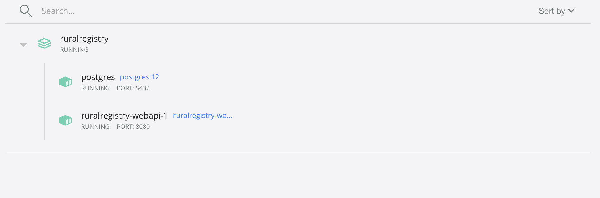
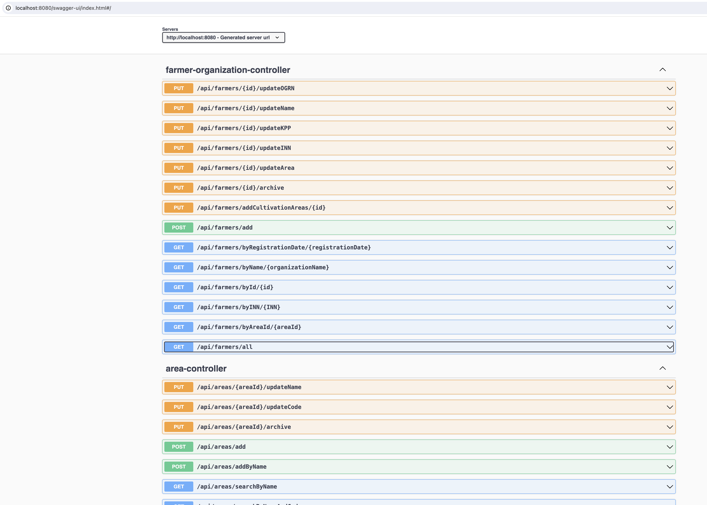

# Инструкция по установке, запуску и работе с приложением

## Установка
1. Убедитесь, что у вас установлены Maven и Java JDK версии 8 или выше.
2. Склонируйте репозиторий с приложением:

    ```bash
    git clone https://github.com/MardeevRuslan/RuralRegistry
    ```

3. Перейдите в каталог приложения:

    ```bash
    cd RuralRegistry
    ```

## Запуск
### Локальный запуск
1. Соберите проект с помощью Maven:

    ```bash
    mvn package
    ```

2. Запустите приложение:

    ```bash
    java -jar target/RuralRegistry-1.0-SNAPSHOT.jar
    ```

### Makefile
1. Соберите проект и запустите приложение с помощью Maven и Makefile:

    ```bash
    make run
    ```

### Docker
1. Соберите Docker образ и запустите контейнер с помощью Docker Compose:
2. Проверьте что контейнеры запущены:
   


## Проверка работоспособности
Перейдите по ссылке [тут](http://localhost:8080/swagger-ui/index.html)

Должны получить страницу с документацией в виде страницы swagger:

